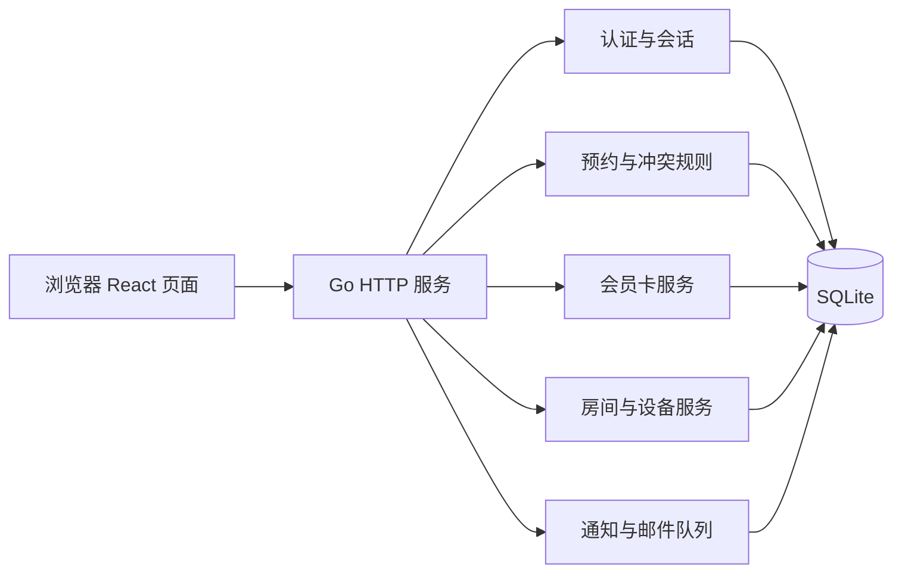

# BandRoom 系统架构说明

## 总体架构

开发模式下 Vite 提供 React 热更新页面并代理 `/api`；演示模式下 React 构建产物位于 `frontend/dist`，Go 同时提供静态页面和 API。

## 后端分层

- `cmd/server`：启动配置、路由注册、静态文件服务和定时任务。
- `internal/*/http.go`：JSON API、认证中间件和请求响应。
- `internal/*/service.go`：会员、预约、设备、通知等业务规则。
- `internal/db`：SQLite 连接和版本化迁移。
- `internal/repository`：基础数据访问和事务辅助。

预约创建在一个事务中检查会员资格、未来预约、房间区间和设备库存，并在成功时扣减次数卡；提交后调用通知服务创建预约通知。

可用时段接口批量读取当天预约占用与闭店区间，在内存计算候选；提交时再次事务校验，以应对查询后新增的预约。
